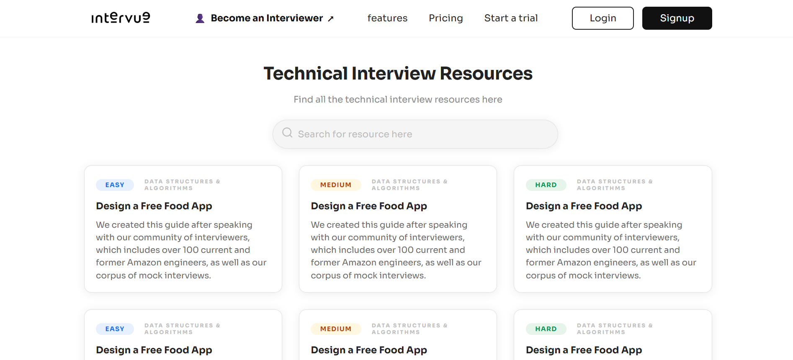
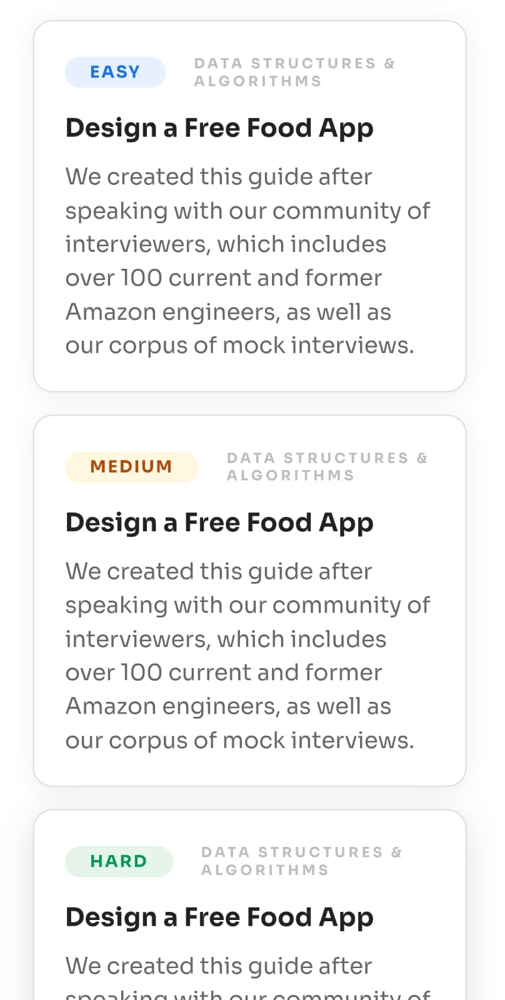

# Intervue Demo - Responsive Web Page Assignment

This project is a fully responsive single-page website built as part of the screening assignment for the Web Developer (HTML/CSS) Intern position at [Intervue.io](https://intervue.io/).

## 🚀 Live Demo

**Hosted on Vercel:** [https://intervuedemo.vercel.app](https://intervuedemo.vercel.app)

---

## 📸 Design Overview

The assignment provided two design mockups:

* **Desktop View** (`Desktop-screen.jpg`)
* **Mobile View** (`Mobile-screen.jpg`)

The implementation aims to replicate both layouts in a single responsive page.

---

## 📚 Features

* ✨ Fully responsive layout for desktop and mobile
* 🧠 Clean semantic HTML5 structure
* 🎨 Styled using [Tailwind CSS](https://tailwindcss.com/) (or plain CSS depending on setup)
* 🔤 Google Font: [Sora](https://fonts.google.com/specimen/Sora)
* 📱 Mobile-first design approach
* 🧩 Icons from a third-party icon library (if needed)
* 🌐 Deployed via [Vercel](https://vercel.com)

---

## 🛠️ Tech Stack

* **HTML5**
* **CSS3** / Tailwind CSS (based on your preference)
* **Responsive Design Principles**
* **Google Fonts**
* **Vercel** for deployment

---

## 📁 Folder Structure

```
intervue_demo/
├── index.html
├── style.css / tailwind.config.js (if Tailwind)
├── assets/
│   └── images, icons, logos
└── README.md
```

---

## 📝 How to Run Locally

```bash
git clone https://github.com/sukanyaghosh74/intervue_demo.git
cd intervue_demo
# If Tailwind used:
npm install
tailwindcss -i ./style.css -o ./output.css --watch
# Otherwise, just open index.html directly
```

---

## 📦 Deployment

The project is deployed using **Vercel**, offering fast and reliable hosting for front-end applications.

---

## 📌 Screenshots

| Desktop                                   | Mobile                                  |
| ----------------------------------------- | --------------------------------------- |
|  |  |

---

## 🙋‍♀️ About Me

**Sukanya Ghosh**
[GitHub](https://github.com/sukanyaghosh74) · [LinkedIn](https://www.linkedin.com/in/sukanya-ghosh-706129274)

---

## 📧 Contact

For any queries related to this project or the assignment, feel free to reach out via LinkedIn or the email used in your application.

---

## 🏁 Submission Info

**Deadline:** July 9th, 2025, 6 PM
**Submission Format:** Deployed link via email only.

---

> "Build great tech teams, faster." — Intervue
